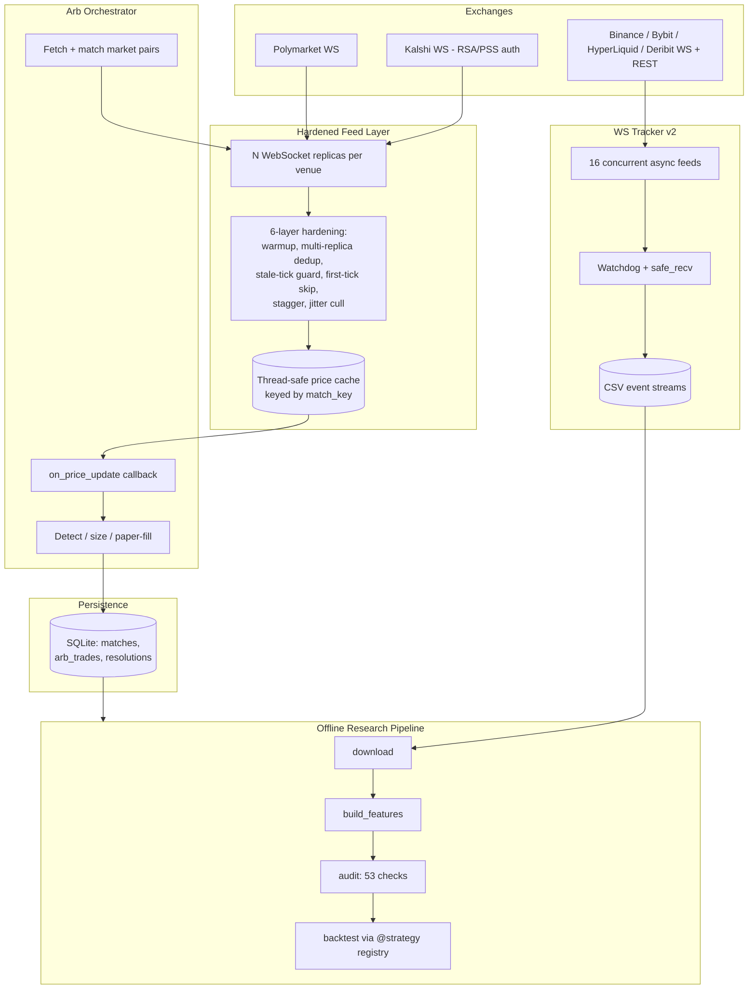

# Real-Time Market Data & Automation Platform — Architecture

This is the architecture document for a private, single-author trading-infrastructure
system written in Python. The codebase itself is not public, but I am happy to walk
through any part of it in an interview. It is a real system that has run for extended
sessions against live exchange WebSocket feeds. This document describes the engineering:
the concurrency model, the failure handling, the data-integrity work, and the lessons
that shaped it. It deliberately contains no trading logic, thresholds, or edge — only
the plumbing that makes such logic safe to run.

## System overview

The platform has three cooperating subsystems:

1. **A hardened feed layer** that maintains many simultaneous WebSocket connections to
   two prediction-market venues and several crypto exchanges, and exposes a single
   thread-safe price cache to the rest of the system.
2. **An orchestrator** that discovers tradable market pairs, subscribes the feed layer
   to the right instruments, reacts to price updates, and records every decision to a
   local database. It runs in a conservative paper mode by default; live execution is
   gated behind an explicit command-line flag.
3. **An offline research pipeline** that builds a labeled historical dataset, audits it
   for look-ahead bias and data quality, and runs pluggable strategies against it
   through a registry.

## The WebSocket reliability problem and the 6-layer hardening pattern

The core difficulty of trading on real-time venue feeds is not parsing messages — it is
trusting them. A WebSocket connection can silently stall, replay a stale cached snapshot
on reconnect, deliver ticks out of order across parallel connections, or degrade into
erratic jitter without ever raising an error. Any one of these produces a *phantom*
signal: the system believes prices are at values they were never actually at, and acts
on it. On a system that can place real orders, a phantom price is the most dangerous
possible failure.

The feed layer addresses this with six independent layers, each defending against a
specific failure mode. They are cheap individually and compound into a feed you can
actually trust.

**Layer 1 — Warmup.** New connections are not trusted immediately. On connect, the feed
enters a short warmup window during which ticks are counted but never acted on. A
monitor thread confirms that replicas are receiving a minimum number of ticks before it
sets a global "warmed up" event. The orchestrator's price-update handler refuses to do
anything until both venues report warmed up. This prevents trading on the first noisy
seconds of a connection.

**Layer 2 — Multi-replica volume with fastest-first dedup.** Rather than one connection
per venue, the layer opens several parallel replicas (more for the higher-throughput
venue, fewer for the auth-limited one). Whichever replica delivers a given price first
wins; a short dedup window drops the duplicate arrivals from the slower replicas. This
turns redundant connections into lower latency and resilience — if one replica stalls,
the others keep the cache fresh.

**Layer 3 — Stale-tick guard.** This is the layer that exists because of a concrete bug.
Prices are seeded from a REST snapshot at startup so the cache is not empty while
WebSockets warm up. But a REST snapshot can be stale, and when the live WebSocket then
delivers the true current price, the jump looks like a wild move. The guard rejects any
tick whose delta from the last known price exceeds a threshold — *except* that if the
same instrument is rejected several times in a row, the guard concludes its own baseline
(the REST seed) was the stale value, resets the baseline, and accepts the live price.
Without this, a stale REST seed created recurring phantom arbitrage signals.

**Layer 4 — First-tick skip.** Some venues send a cached book snapshot as the first
message on a new subscription. That first tick is dropped from every new connection,
so a reconnect never re-injects an old snapshot into the live cache.

**Layer 5 — Startup stagger.** Replica startups are spread across a short interval rather
than fired simultaneously. Staggering the connections diversifies which replica is
"ahead" at any moment and avoids a thundering-herd reconnect after a network blip.

**Layer 6 — Anti-jitter reaper.** Each replica tracks the variance of its inter-tick
intervals as an exponential moving average. A cull loop periodically kills the worst
jitter offenders and lets them respawn fresh — but only after a grace period (so new
connections are not culled before they stabilize), only if their jitter is meaningfully
worse than the median, and only within a global respawn budget so a bad network never
sends the system into a reconnect storm.

Every accept and every rejection is counted per layer and surfaced in a health readout,
so the feed's behavior is observable at a glance rather than inferred.

## Concurrency model

Two different concurrency styles are used deliberately, matched to their workloads.

The **feed layer and orchestrator** use OS threads. Each replica runs its connection's
`run_forever` loop on its own daemon thread, with separate daemon threads for the warmup
monitor and the cull loop. All shared state — the price cache, the token/ticker→match
mappings, the per-instrument last-known-price table, and the health counters — is guarded
by dedicated locks, each held for the shortest possible critical section. Price updates
are delivered to the orchestrator through a callback, and the orchestrator's handler is
written to be re-entrant and fast: check warmup, read a cache snapshot under lock, then
do all detection and sizing on local copies outside the lock. Threads fit here because
the hot path is a synchronous WebSocket client library and because the work per tick is
small and CPU-light.

The **data collector** (`ws_tracker_v2.py`) uses `asyncio` because it fans out to 16
concurrent feeds — Polymarket order books, per-coin trade/depth/liquidation/mark streams
across several crypto venues, plus REST pollers for data only available by polling. They
are launched together under a single `asyncio.gather`. The critical piece is `safe_recv`:
a receive wrapped in a timeout that, on expiry, sends a ping and waits briefly for a pong
before deciding the socket is dead and reconnecting. An earlier version had a feed that
silently died after roughly an hour because a half-open socket never returned from
`recv`; `safe_recv` makes that unrecoverable state impossible. A watchdog coroutine wakes
on a heartbeat interval, and for the feeds that are *supposed* to be continuously live
(as opposed to event-driven streams like liquidations) it logs a critical warning if one
has produced no events past a dead threshold. Every feed reconnects on its own with its
error and connect counts tracked, so a single venue hiccup never takes down collection.

## Data integrity and backtesting honesty

The most valuable engineering in this project is not a feature — it is a correction.

An early version of the research pipeline reported strategy win rates that looked strong.
They were wrong. A feature was being computed with a timing offset that let information
from *inside* the prediction window leak into the "at open" feature values — classic
look-ahead bias. The inflated results were roughly nine percentage points above the
honest numbers. Once the leak was found and the features were recomputed strictly from
data available at decision time, the same strategies dropped to their real, far more
modest performance. The lesson stuck: a backtest that flatters you is worse than no
backtest, because you will size real money against it.

To make that failure mode structurally hard to repeat, the pipeline ships with a
dedicated auditor (`audit.py`) that runs a battery of checks across four stages —
raw candle data, resolution labels, the built feature set, and an explicit look-ahead
probe:

- **Raw data:** every coin's candles are checked for zero NaN across OHLCV, monotonic
  non-duplicated timestamps, bounded gaps between candles, and basic OHLC validity
  (high ≥ open/close, low ≤ open/close).
- **Labels:** resolutions must be one of the two allowed outcomes, window durations must
  match their timeframe exactly, window starts must be aligned to the timeframe boundary,
  no duplicates, and the outcome balance must sit in a sane range.
- **Features:** required columns present, feature-set resolutions reconciled against the
  source labels with zero tolerance for mismatch, bounded indicator ranges, and a check
  that indicator values are actually diverse (a near-constant column signals a broken
  computation).
- **Look-ahead probe:** the auditor deliberately confirms that a feature derived from the
  known outcome predicts at ~100% (proving the labeling logic is sound) *while* the
  genuine predictor features do **not** — an indicator that suddenly predicts far better
  than it should is the fingerprint of leakage, and the audit fails loudly on it.

The dataset that survives all of this is tens of thousands of verified windows across
four coins with zero NaN, and the full audit passes every check. That "all checks passed"
line is the precondition for believing any number the backtester prints.

## Persistence and replay

Persistence is a small, deliberately boring SQLite layer (`arb_db.py`) with three tables:
`matches` (the discovered market pairs and how confidently they were matched),
`arb_trades` (each decision, with both legs, costs, estimated fees, and edge), and
`resolutions` (the eventual outcome and realized P&L). It is an append-oriented event
log: a decision is written when it is made, and its resolution is written later as a
separate record joined by id, so the history of what the system believed and did is never
overwritten.

Two choices matter for correctness under concurrency. Every function opens its own
connection rather than sharing one across threads, which sidesteps SQLite's
single-connection threading constraints entirely. The database runs in WAL mode so
readers (the dashboard, the resolution checker) never block the writer. Recording an
outcome inserts the resolution row and flips the trade's status in a single committed
transaction, so a trade is never left in a half-resolved state. Because the schema is a
plain event stream, the entire trading history can be replayed and re-aggregated offline
without rerunning the live system — performance summaries are just queries over the same
tables.

## Lessons learned

- **Redundancy beats reconnection.** Several cheap parallel connections with fastest-first
  dedup produced a more reliable feed than any single connection with clever reconnect
  logic. The system assumes connections fail and routes around them rather than trying to
  keep any one alive.
- **A stalled socket is worse than a closed one.** A closed socket raises; a half-open one
  hangs forever. Every receive path has a timeout with a ping-based liveness check, and a
  watchdog independently flags feeds that should be live but have gone quiet.
- **Distrust your own startup state.** The stale-tick guard and first-tick skip both exist
  because the *seed* data — REST snapshots and cached first messages — was the source of
  phantom signals, not the live stream. Convenience data used to avoid an empty cache has
  to be treated as suspect until the live feed corroborates it.
- **A flattering backtest is a liability.** The nine-point inflation from a look-ahead bug
  is the reason the pipeline now has an auditor whose entire job is to try to prove its own
  results are fake before I trust them. Build the check that catches you.
- **Gate the dangerous mode explicitly.** Live execution is opt-in behind a flag and the
  default is paper; warmup, staleness, position, and exposure guards all sit in front of
  any action. The safe path is the one you get by default.
- **Match the concurrency model to the work.** Threads for the synchronous, lock-guarded
  hot cache; asyncio for the wide fan-out of many I/O-bound feeds. Neither was forced to
  cover for the other.
